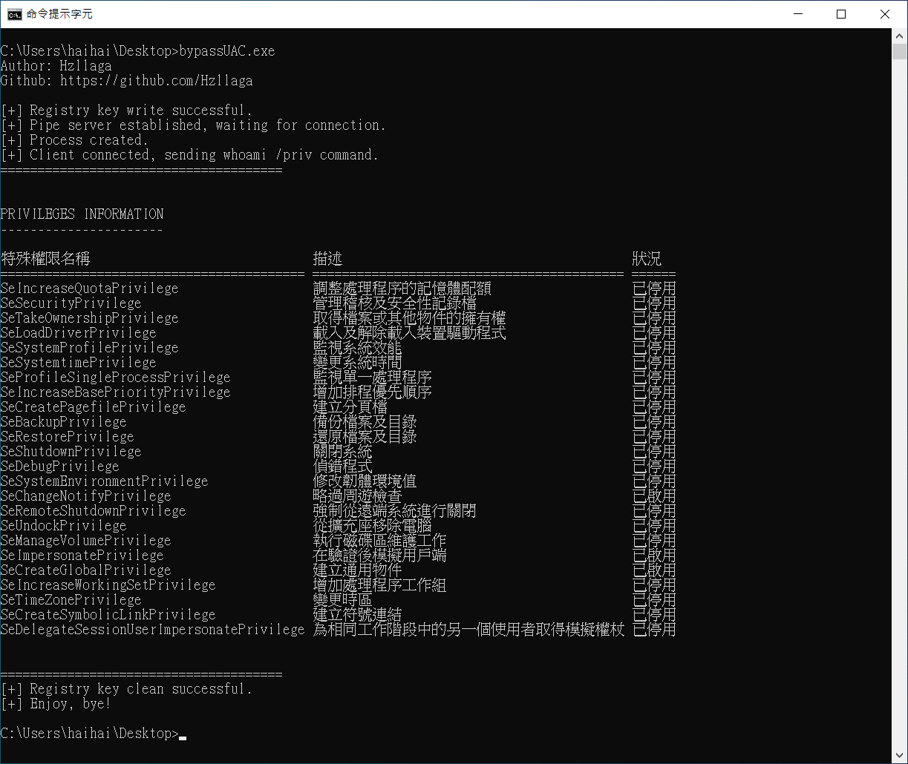

# 基于注册表劫持BypassUAC

通过管道进行通信，可以在非交互模式运行。

## 使用方式

将`bypassUAC.exe`和`PipeClient.exe`放在同目录

```
.\bypassUAC.exe "whoami /priv"
```



## 参考链接

https://github.com/SkewwG/domainTools/tree/master/regeditBypassUAC

https://idiotc4t.com/privilege-escalation/bypassuac-fodhelper

